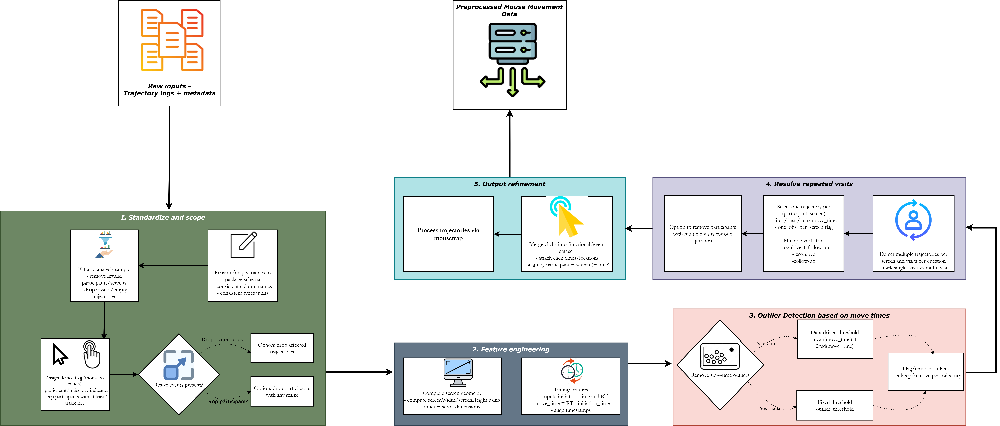

```{r setup, include = FALSE}
knitr::opts_chunk$set(
  collapse = TRUE,
  comment = "#>",
  fig.width = 7,
  fig.height = 4.5,
  warning = FALSE,
  message = FALSE
)


# For development
devtools::load_all("C:/Users/theer/OneDrive/Documents/mousepackage")

library(dplyr) 
```


# Overview

`mousePrep`is data preprocessing package as a precursor to `mouseTrap` package. It helps turn raw data into clean, standardized, mouseTrap-ready datasets. The package offers a smooth and compartmentalized workflow of the data preprocessing using wrapper functions. All the package functions are exhaustive i.e., they encompass the calculations going from the raw data to the output value within the functions themselves, except standardization functions. For this reason, it is strongly recommended that the raw datasets are always standardized and cleaned before any calculations are applied. 

The package supports these broad goals:
- column name and data type standardization,
- case and event filtering,
- screen geometry calculations,
- time-related feature engineering,
- outlier detection,
- repeated-visit handling,
- creation of click data,
- processing through the `mousetrap` package, and
- export of cleaned long or wide datasets.

The package is designed for the wrangling actions that typically happen before statistical modeling, visualization, or machine learning.

# Installation

You can install the development version of `mousePrep` from GitHub.

```{r install, eval = FALSE}
install.packages("devtools")
devtools::install_github("soda-lmu/mousePrep")
```

Load the package:

```{r load-package, eval = FALSE}
library(mousePrep)
library(dplyr)
```

# Recommended workflow

A typical `mousePrep` workflow has these 5 stages.

```{r workflow-image,out.width="100%",align = "center", echo=FALSE, fig.cap="mousePrep processing workflow"}

```

You do not always need to use every function. The exact workflow depends on the structure of the raw data and the intended analysis. However, for consistent use of the functions, we recommend that the raw datasets are standardized using standardize_colnames() and convert_numeric().  

# Input data

`mousePrep` expects mouse-tracking data in a long format where each row usually represents one recorded event or point in a mouse trajectory.

A typical dataset may include:

| Column type | Example columns | Description |
|---|---|---|
| Participant ID | `mt_id`, `worker_id`, `participant_id` | Identifies participants or trajectories |
| Question or screen ID | `question_id`, `screen_id` | Survey item, screen, or task identifier. One participant can have multiple screen IDs |
| Time variable | `timestamps`, `timeStamp`, `time` | Time of each recorded event |
| Coordinates | `xpos`, `ypos`, `ClientX`, `ClientY` | Mouse position |
| Screen dimensions | `inner_width`, `inner_height`, `scroll_width`, `scroll_height` | Browser and page dimensions. Inner dimensions correspond to the screen visible in the browser while scroll dimensions are of the physical monitor. |
| Event type | `type`, `event_type` | Mouse move, click, resize, touch, etc. |
| User type | `userAgent_is_pc`, `userAgent_is_mobile` | User devise and browser family |


Data can first be loaded using standard R functions.

```{r read-data, eval = FALSE}
raw_data <- read.csv("data/raw_mouse_data.csv")
```

# Example data structure

(Replace this with your own imported data.)

```{r toy-data, echo=TRUE}
mouse_raw <- tibble::tibble(
  workerId = rep(c("p1", "p2"), each = 5),
  screenId = rep("q1", 10),
  timestamp = c(0, 100, 250, 400, 700, 0, 120, 260, 410, 800),
  xpos = c(10, 20, 35, 50, 80, 12, 24, 40, 55, 90),
  ypos = c(15, 25, 45, 60, 90, 18, 32, 50, 70, 95),
  eventType = rep("mousemove", 10),
  innerWidth = rep(1200, 10),
  innerHeight = rep(800, 10),
  scrollWidth = rep(1200, 10),
  scrollHeight = rep(1000, 10)
)
```

# 1. Standardize raw data

## Standardize column names

Raw mouse-tracking datasets often use inconsistent names across platforms, survey tools, or exports. `standardize_colnames()` makes sure that there are common column names, types, and units so later functions can be applied consistently. The renamed columns will be listed if verbose is applied TRUE. 

```{r standardize-colnames, echo=TRUE}
mouse_std <- standardize_colnames(mouse_raw, verbose = TRUE)
  
```


## Convert numeric columns

`convert_numeric()` converts commonly appearing numeric-like columns to numeric type. A column is treated as numeric-like if all of its non-missing and non-empty values can be converted to numeric after standardizing symbols.

```{r convert-numeric, eval = FALSE}
mouse_std <- convert_numeric(mouse_std)
```

# 2. Filter invalid cases and events

## Remove invalid cases

Use `rm_cases()` to remove invalid participants, screens, or empty trajectories. Use criteria 1 to remove only the screen/worker ID where the criterion is met while criteria 2 removes all data from the participant.

```{r rm-cases, echo=TRUE}
mouse_clean <- mouse_std %>%
  rm_cases(column_rm = "userAgent_is_touch_capable",
           factor_rm = TRUE,
           criteria = 1) %>%
  rm_cases(column_rm = "type",
           factor_rm = "resize",
           criteria = 1) 
```

## Create click dataset

If certain type of trajectories have to be subsetted, use `sl_cases`. It's another filter function that could be used to create new dataframes. 

```{r rm-touch-devices, eval = FALSE}
click_df <- sl_cases(mouse_clean, column_sl = "type", factor_sl = "click")
```


# 3. Create geometry and timing features

## Calculate screen dimensions

`calculate_screen_dims()` computes screen width and screen height. It will rewrite the values if the columns already exist. The inputs used are inner height, inner width, scroll width and scroll height.

```{r screen-dims, eval = FALSE}
screen_dims_data <- calculate_screen_dims(mouse_clean)
```

If you are working with UAS-style datasets, set `uas = TRUE` and the function uses UAS default column names and defaults for selecting columns, so you can call the function with only `data`.


## Calculate timing variables

`time_vars_calculate()` derives key timing variables from trajectory timestamps.

The outputs include:

| Variable | Meaning |
|---|---|
| `initiation_time` | Time until first movement |
| `response_time` | Total time spent on the screen or question |
| `move_time` | Time between movement initiation and response |

```{r time-vars, eval = FALSE}
time_df <- calculate_time_vars(mouse_clean)
```

# 4. Detect and remove outliers

## Remove cases based on time spent

`rm_cases_time()` removes cases or participants based on total time spent on a question or screen.

```{r rm-cases-time, eval = FALSE}
mouse_time_flag <- rm_cases_time(mouse_clean, max_time = 7)
```

## Classify mouse movement density

`mouse_class()` and `mouse_class_col()` help identify cases with too few recorded mouse or touch movement points per screen.

Use `mouse_class()` when you want to remove these cases directly. 
Use `mouse_class_col()` when you want to flag cases first and decide later whether to remove them.

```{r mouse-class, eval = FALSE}
mousemove_flag <- mouse_class(mouse_clean, max_cutoff = 50)
mousemove_remove <- mouse_class_col(mouse_clean, max_cutoff = 50)
```


## Based on timing variables

`flag_outliers()` can flag unusual observations using data-driven rules or fixed thresholds.
`"data"`, values are flagged as outliers when they are greater than the mean plus two standard deviation

```{r flag-outliers-data, eval = FALSE}
mouse_flag <- flag_outliers(time_df,
    flag_outliers = "data",
    filter_var = "move_time")
```

You can also use a fixed threshold.

```{r flag-outliers-threshold, eval = FALSE}
mouse_flag <- flag_outliers(time_df,
    flag_outliers = "threshold",
    filter_var = "move_time")
```

Once outliers are flagged, use `rm_cases()` to remove them.

# 5. Handle repeated visits and clicks

## Repeated trajectories

Some participants may visit the same screen or question multiple times. `multiple_traj()` gives the option of flagging the whole participant if they have multiple trajectories or flag only their first, last, or longest trajectory.

```{r multiple-traj, eval = FALSE}
mouse_single_visit <- multiple_traj(mouse_clean)
```
 
`rm_cases()` to remove the repeated visits if needed.

## Include click data

`include_clicks()` indicates a trajectory as click by matching it to the nearest timestamp.

```{r include-clicks, eval = FALSE}
mouse_with_clicks <- include_clicks(dat_complete = mouse_clean, dat_clicks = click_df)
```

This is useful when you want to analyze both movement paths and final click behavior.

# 6. Process data with mousetrap

`mp_processing_mt()` runs the cleaned dataset to the `mousetrap` package workflow. It imports mouse-tracking data in the long format, time-normalizes trajectories, computes derivatives, and calculates summary measures using the `mousetrap` package.

This step can be used to create normalized trajectories, derivatives, and common mouse-tracking measures.

```{r mousetrap-processing, eval = FALSE}
mt_processed <- mt_process_data(mouse_clean,
    nsteps = 101, hover_threshold = 500)
```

# 7. Export final datasets

Use `mp_export_dataset()` to export the cleaned and processed dataset in long or wide format. Can optionally join with other dataframes.

```{r export-long, eval = FALSE}
mouse_long <- mp_export_data(data = mt_data,direction = "long",long_join_data = participant_info,id = "mt_id")
```

You can then save the output with standard write functions.

```{r save-output, eval = FALSE}
write.csv(mouse_long, "data/processed/mouse_long.csv", row.names = FALSE)
```


# Summary

`mousePrep` is a package designed primarily for UAS mouse movement datasets but can also be generalized for other mouse tracking data. The package functions take raw mouse trajectories as input and requires minimum dependency on outside functions to complete the preprocessing pipeline. The package outputs data in wide and long formats, prepared for analysis with `mousetrap`. 

